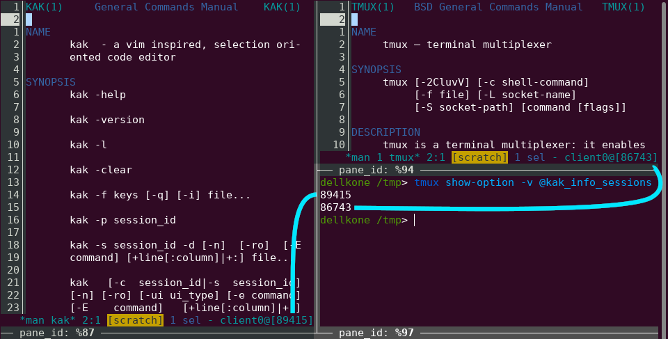

# tmux-kak-info.kak

[](https://opensource.org/licenses/Apache-2.0)

**tmux-kak-info.kak** is a
[Kakoune](https://github.com/mawww/kakoune) tiny plugin that helps write scripts
that integrate Kakoune with the terminal multiplexer
[tmux](https://github.com/tmux/tmux).
Specifically, the plugin ensures that in every tmux session there is a tmux
option `@kak_info_sessions` that lists the identifiers of all kakoune sessions
started within that tmux session.



## Installation

### With plug.kak

You can install **tmux-kak-info.kak** using the
[plug.kak](https://github.com/andreyorst/plug.kak) plugin manager by extending
your `kakrc` with:

```kak
plug "jbomanson/tmux-kak-info.kak"
```

Then restart Kakoune and run `:plug-install`.

### Manually

In your `kakrc`, include:

```sh
source "/path/to/tmux-kak-info.kak/rc/tmux-kak-info.kak"
```

## Usage

Suppose you are in a tmux session where you have started two kakoune sessions
that have identifiers 11111 and 22222.
Then, you may write the following in any pane in that session:

```sh
tmux show-option -v @kak_info_sessions
```

The result will be:
```sh
11111
22222
```

To give an idea of how this can be useful, this is how you may print "Hello
world!" to the debug buffer within the first of those kakoune sessions:

```sh
echo "echo -debug Hello world!" | kak -p "$(tmux show-option -v @kak_info_sessions | head -n1)"
```
